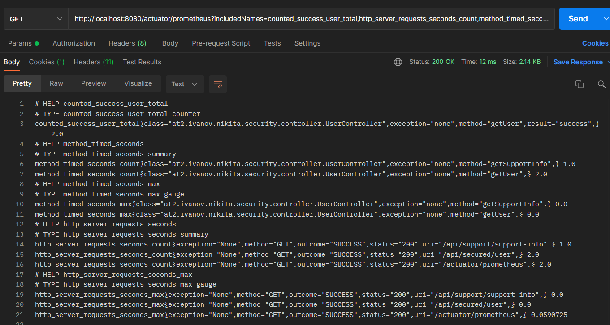
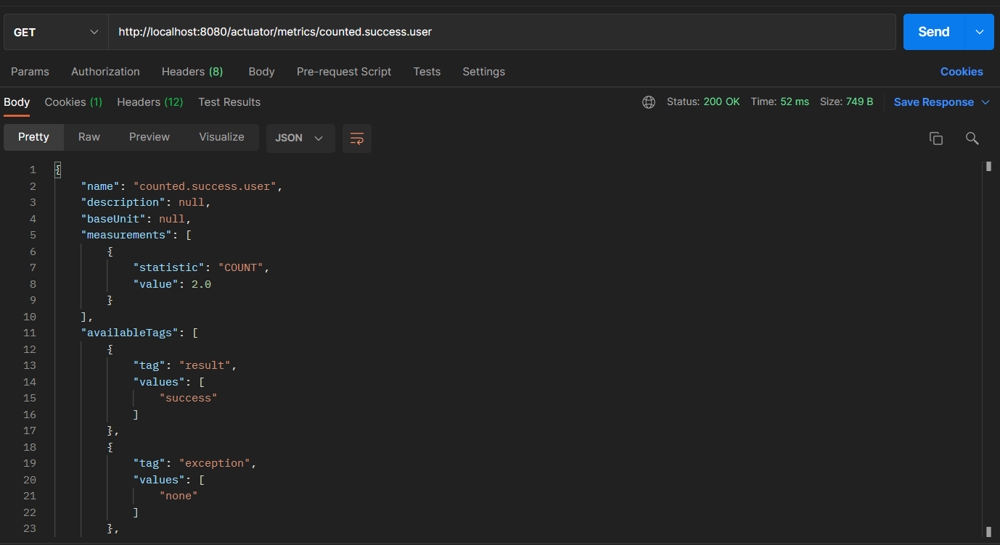

# Домашка По теме Обслуживание
          
1) Создать (можно использовать существующее из предыдущих заданий) веб приложение которое бы отдавало следующие метрики:
  - количество запросов 
  - время выполнения запроса
2) Создать свою метрику. Например количество пользователей онлайн. Можно сделать счетчик который увеличивается через определенный интервал и его результат отдавать в метриках приложения
3) Создать свой актуатор. Например, при вызове которого в лог выводилось сообщение с датой и временем вызова актуатора

Пункт 1. Метрики отдаются в формате prometheus.

Количество запросов и время обращения к каждому эндпоинту видно через 
http_server_request... (доступ к тем же самым данным можно получить и через
/metrics). Помимо вызовов эндоинтов сервера, можно навесить аннотации 
@Counted @Timed, для того, чтобы получить метрики вызовов конкретных методов  

Все метрики так же доступны и через /metrics

Пункт 2 и 3 в пояснении не нуждаются.