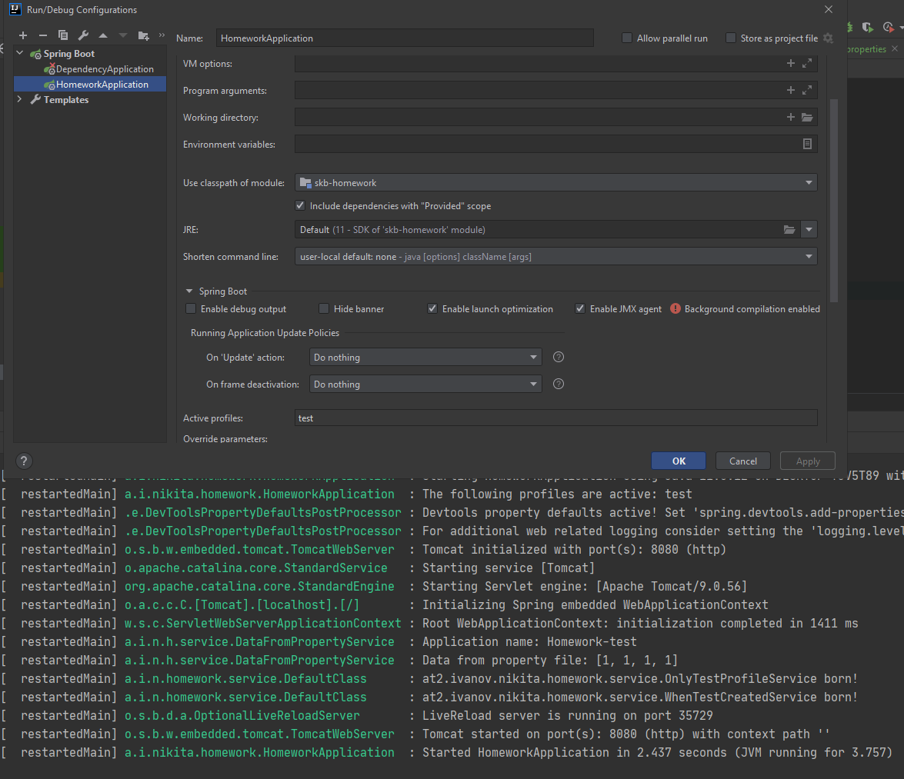
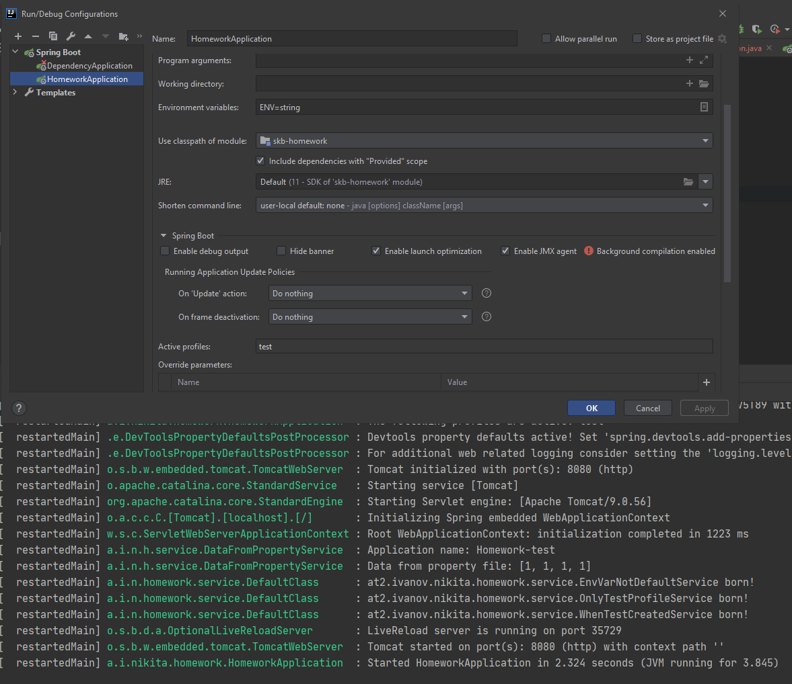

# Домашка 4

1) Создать 3 профиля - dev, test, prod, каждый из которых будет включать в себя:
   - 1.1 конфиг с листом из нескольких значений
   - 1.2) название приложения
   - 1.3) конфиг с переменной окружения, по дефолту значение - default
2) 3 бина:
   - 2.1) один создается, только если профиль test,
   - 2.3) другой, если существует первый бин,
   - 2.3) третий, если в конфиге с не “default” (тут в идеале со скриншотом)

### Сервис с переменной окружения
- в первом случае не создается, так как переменная не определена   

- во втором случае задал переменную и все бины создались
